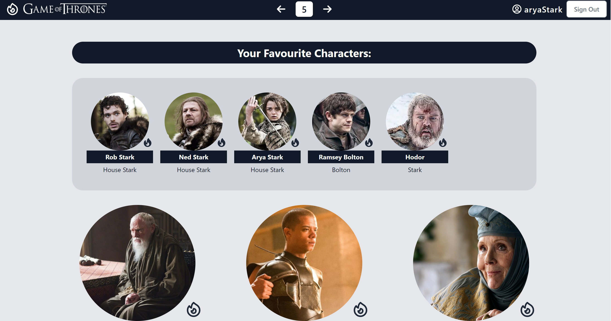
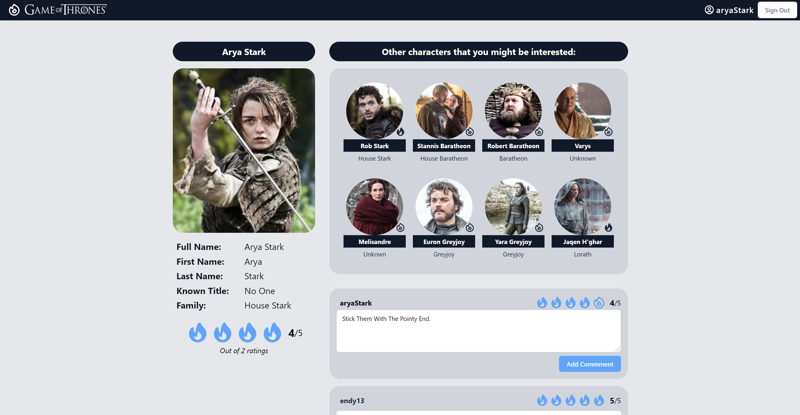

# React - Game of Throne Characters

A website to browse through Game of Throne characters.
This is part of React capstone project for PowerX Fundamentals in Frontend Development Module.

## Website




## Installation

Install project dependencies
```bash
$ npm install
```

Start server
```bash
$ npm run start
```
Visit http://localhost:3000/ to view the website

To load React styleguidist
```bash
$ npm run styleguide
```
Visit http://localhost:6060/ to view the component documentation

To build React styleguidist for production
```bash
$ npm run styleguide:build
```

## Features

1. Bookmark characters that you love! It uses localStorage to keep it, not based on authorization.
2. Sign up an account and join others to give comments for each character. You can even rate them as well!

## API Calls

For auth and comments, API calls are made to:
https://endy-backend-database.herokuapp.com

For Game of Thrones data, API calls are made to:
http://viewers-guide.hbo.com/images/original531de918067e7.png